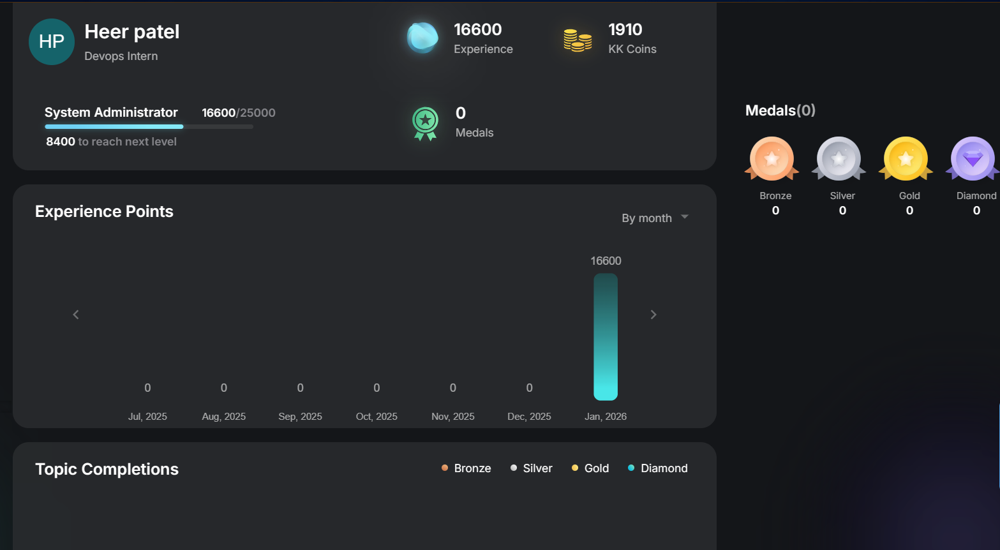

  

  

---

# 👋 Heer Patel  
**DevOps Intern | Cloud & Backend Engineer (Node.js)**  
**Linux • AWS • Docker • CI/CD • Redis • Webhooks**

---

## 🚀 About Me
I’m a DevOps Intern with hands-on experience in Linux systems, deployment support, and backend development.  
I enjoy building secure and scalable products, automating workflows, and improving reliability through real-world learning.

---

## 🔧 Tech Stack
- **DevOps & Cloud:** Linux, Git/GitHub, Docker, CI/CD, AWS (Fundamentals), Redis  
- **Backend:** Node.js, Express.js, MongoDB, REST APIs, Webhooks  
- **Tools:** Nginx/Apache, Postman

---

## 🌟 Featured Projects

### 🔹 Frontilio — No-Code Twilio Communication Platform
A secure no-code communication platform powered by Twilio. Users can add Twilio credentials, pick a plan, and send SMS instantly from a dashboard.  
✅ Encrypted credentials (in-transit + at-rest)  
✅ Webhook-based real-time delivery tracking  
✅ Redis caching for performance  
✅ Paddle subscription billing + Brevo transactional emails  
**Tech:** Node.js, Redis, Webhooks, Twilio API, Paddle, Brevo

---

### 🔹 Ai-Grammer — AI Text Enhancement Platform
AI-powered web app that improves grammar and enhances descriptions.  
✅ Login/Signup with protected access  
✅ Redis-based rate limiter for request control  
✅ History tracker for saved prompts and results  
**Tech:** Node.js, Express.js, Redis, MongoDB, Authentication (JWT/Sessions)

---

### 🔹 Visa & Passport Application Portal (Simulation)
Full-stack simulation platform where users apply for Passport/Visa and admins approve/reject applications via dashboard.  
✅ Multi-step application flow  
✅ Admin dashboard with filters & status updates  
✅ Document uploads and structured MongoDB schema  
**Tech:** React, Node.js, Express, MongoDB, REST APIs

---

## 🧠 LeetCode Activity

🔗 Profile: https://leetcode.com/u/Nf0p503mKo/

### 📅 Live LeetCode Heatmap

---

## 🐍 Contribution Snake
Git Hub

---

## 📚 KodeKloud Progress
Hands-on DevOps learning through labs & practice.

---
## 📫 Connect with Me
🔗 LinkedIn: https://www.linkedin.com/in/heer-patel-7ba59230a  
💻 GitHub: https://github.com/HeerPatel30  
